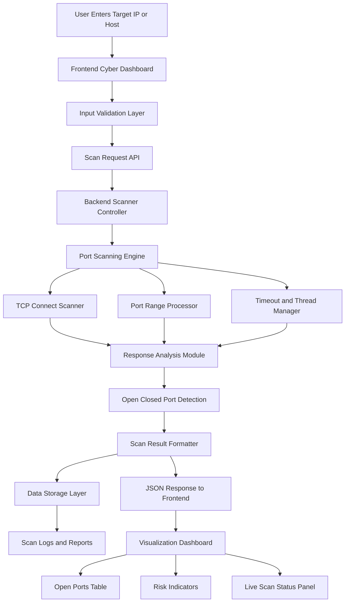

# 🚀 CyberScan X - Autonomous Vulnerability Discovery Dashboard

<p align="center">
  
  
  
  
  
  
</p>

<p align="center">
  <b>AI-Powered Port Scanner • Service Detection • Cyber Intelligence Dashboard</b>
</p>

------------------------------------------------------------------------

# 🧠 Project Overview

CyberScan X is a futuristic, AI-powered cybersecurity dashboard designed
for real-time port scanning, service detection, and vulnerability
intelligence.\
It features a premium SOC-style interface with live analytics, cyber
intelligence modules, and a high-performance parallel scanning
architecture.

The platform is built as a frontend-first cyber dashboard that works
instantly, with an optional backend for persistence and advanced
scanning features.

> ⚠️ Educational and ethical cybersecurity use only.

------------------------------------------------------------------------

# ⚡ Quick Start (Frontend -- Instant UI Launch)

``` bash
cd client
npm install
npm run dev
```

Open: http://localhost:5173

The full dashboard UI loads immediately --- no database or backend
required.

------------------------------------------------------------------------

# 🖥️ Optional Backend (Persistence + Scanner Engine)

``` bash
cp .env.example .env
npm install
npm run server
```

Default backend: http://localhost:5000\
If backend is not running, the UI still works (history panel will be
empty).

------------------------------------------------------------------------

# ✨ Core Features

## 🔎 Advanced Port Scanning

-   High-speed parallel TCP port scanning
-   Custom port range (1--65535)
-   Configurable timeout & concurrency
-   Real-time scan progress visualization
-   Async non-blocking scanning engine

## 🛰️ Deep Service Detection

-   Automatic banner grabbing
-   Service fingerprinting
-   Protocol classification
-   Risk tagging per open port

## 🤖 AI Security Intelligence Engine

-   AI-based vulnerability insights
-   Risk scoring (Low / Medium / High / Critical)
-   Smart security recommendations
-   Attack surface analysis

## 📊 Futuristic Cyber Dashboard UI

-   AI Attack Surface Intelligence Panel
-   Port Intelligence Feed
-   Protocol Distribution Analytics
-   Node Status Matrix
-   Console Output Terminal
-   Security Intelligence Module
-   Cyber Safety Assurance Panel

------------------------------------------------------------------------

# 🏗️ Repository Architecture

    CyberScanX-PortScanner/
    ├── client/            # React + Vite Cyber Dashboard
    ├── server/            # Node.js + Express Backend
    ├── prisma/            # Database Schema (Prisma ORM)
    ├── public/            # Static Assets
    ├── .env.example       # Environment Template
    ├── package.json       # Root Scripts & Dependencies
    └── README.md

------------------------------------------------------------------------

# 🔄 System Working (Block Diagram)



------------------------------------------------------------------------

# ⚙️ Technology Stack

## 🎨 Frontend

-   React (Modern)
-   Vite 7
-   TypeScript (Strict)
-   Tailwind CSS (Cyber Theme)
-   Recharts (Charts)
-   Framer Motion (Animations)
-   Socket.io Client

## 🧩 Backend

-   Node.js + Express
-   Native TCP Socket (`net` module)
-   Async Parallel Scanner Engine
-   WebSockets (Real-time updates)
-   AI Analysis Module

## 🗄️ Database

-   PostgreSQL / MySQL (Cloud SQL)
-   Prisma ORM
-   Normalized Schema (3NF)
-   No MongoDB / No Supabase / No Local DB

------------------------------------------------------------------------

# ⚡ How the System Works

1.  User enters IP / Domain / URL\
2.  Input is sanitized (URL → Host)\
3.  Parallel scanner scans ports asynchronously\
4.  Open ports trigger banner & service detection\
5.  AI engine evaluates risk level\
6.  Results streamed via WebSockets\
7.  Dashboard updates in real-time

------------------------------------------------------------------------

# 🔐 Security & Ethical Use

-   Educational cybersecurity tool
-   Safe TCP connect scanning
-   Input validation & sanitization
-   Legal disclaimer before scanning
-   Do NOT scan unauthorized systems
